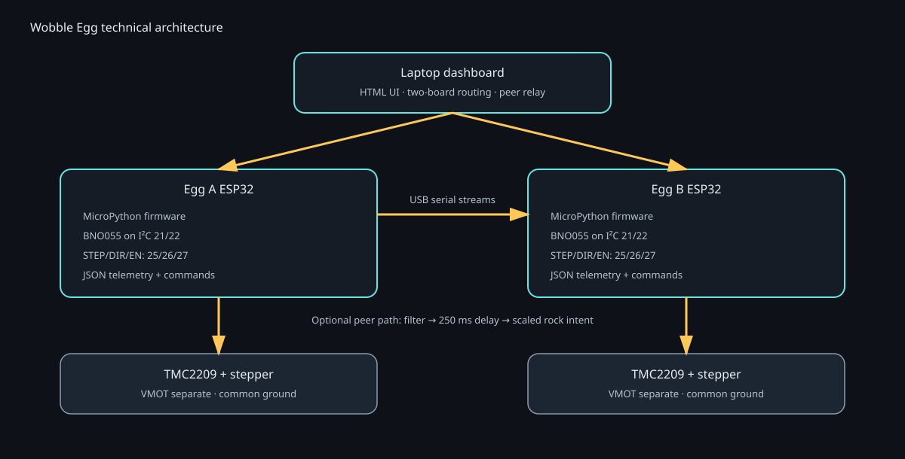
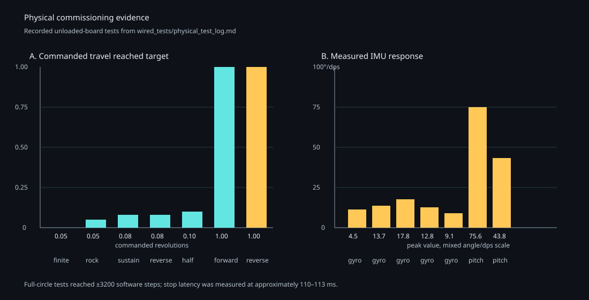

# Wobble Egg Mechanism
## Technical deck and product specification

**Project:** two-board ESP32 wobble-egg demonstrator
**Audience:** controls, embedded systems, mechatronics, and product engineering
**Status:** functional prototype with validated USB control path; Wi-Fi path retained as a separate experimental branch

---

## 1. Executive summary

The Wobble Egg is a self-righting, egg-shaped mechatronic platform whose internal stepper motor generates controlled rocking or rotational motion. Each egg combines:

- ESP32 MicroPython control
- BNO055 9-axis IMU with hardware sensor fusion
- TMC2209 stepper driver in STEP/DIR mode
- Four-wire, two-phase stepper motor
- Laptop dashboard for telemetry, commands, calibration, and peer coordination

The repository contains three connected layers:

1. **Mechanism and physics model** — egg geometry, center of mass, contact dynamics, motor-method simulation, and performance metrics.
2. **Embedded control** — deterministic motor commands, hardware PWM step generation, IMU acquisition, JSON telemetry, and bounded safety behavior.
3. **Operator and coordination tools** — a local dashboard, two-board routing, USB serial transport, and laptop-relayed peer mode.

The current demonstrated operating mode is **USB serial**, because it is deterministic and easy to diagnose. A separate Wi-Fi dashboard branch supports HTTP telemetry and commands when the access point is compatible with the ESP32 firmware.



---

## 2. Product concept

### User-facing behavior

Each egg can:

- stream orientation and inertial data to a laptop;
- rotate in one direction to a commanded shaft distance;
- rock back and forth for a finite number of cycles;
- sustain a continuous rocking pattern until stopped;
- reverse direction without changing the selected board;
- tare the IMU relative to its current pose;
- stop normally or stop immediately;
- optionally follow the other egg through filtered, delayed motion intensity.

### Design intent

The product is not intended to infer physical shaft position from the IMU. Motor travel is commanded and tracked in firmware; the IMU measures body motion and orientation. This distinction is important for evaluating slip, missed steps, mechanical compliance, and sensor faults.

### Prototype success criteria

| Area | Demonstrated target |
|---|---|
| Independent control | Separate command path for Egg A and Egg B |
| Distance control | One-way motion with automatic stop at target steps |
| Rocking | Finite rock cycles and continuous rock mode |
| Sensing | BNO055 stream at approximately 30 Hz |
| Operator response | USB stop latency measured at approximately 110–113 ms |
| Peer behavior | Filtered IMU intensity, 250 ms delay, configurable follower fraction |
| Diagnostics | Board-specific connection, error, motor, and sensor state |

---

## 3. System architecture

```text
                         ┌──────────────────────────────┐
                         │ Laptop dashboard             │
                         │ HTML controls + telemetry UI  │
                         └──────────────┬───────────────┘
                                        │
                         newline-delimited JSON over USB
                                        │
             ┌──────────────────────────┴──────────────────────────┐
             │                                                     │
   ┌─────────▼─────────┐                               ┌───────────▼────────┐
   │ Egg A ESP32        │                               │ Egg B ESP32         │
   │ main.py            │                               │ main.py             │
   │ BNO055 + Stepper   │                               │ BNO055 + Stepper    │
   └──────┬─────────────┘                               └──────────┬─────────┘
          │ I²C: SDA 21 / SCL 22                                  │
          ▼                                                        ▼
     BNO055 IMU                                             BNO055 IMU
          │                                                        │
          └─────────────── STEP/DIR/EN control ────────────────────┘
                           GPIO 25 / 26 / 27
                                      │
                               TMC2209 driver
                                      │
                                stepper motor

 Optional laptop peer path:
     Egg A telemetry → motion filter → 250 ms delay → scaled rock intent → Egg B
     Egg B telemetry → motion filter → 250 ms delay → scaled rock intent → Egg A
```

Reference implementation: [`dashboard/server.py`](../dashboard/server.py), [`firmware/main.py`](../firmware/main.py), and [`dual_board/ripple_logic.py`](../dual_board/ripple_logic.py).

### Repository map

| Area | Key files | Responsibility |
|---|---|---|
| Physics and mechanism | `src/egg_model.py`, `src/physics_engine.py`, `src/motor_methods.py` | Geometry, mass properties, dynamics, actuation models |
| Simulation evaluation | `experiments/baseline_tests.py`, `src/metrics.py` | Standardized motor-method tests and scoring |
| Embedded firmware | `firmware/main.py`, `firmware/bno055.py` | IMU, stepper, command parser, telemetry |
| USB dashboard | `dashboard/server.py`, `dashboard/index.html` | Serial bridge, two-board routing, UI |
| Peer logic | `dual_board/ripple_logic.py` | Filtering, packet timing, follower scaling |
| Wi-Fi experiment | `wifi_dashboard/` | ESP32 HTTP API and laptop HTTP proxy |
| Physical commissioning | `wired_tests/` | Hardware test runners, coordinates, test logs |

---

## 4. Mechanism and kinematics

### Egg body

The intended body is a bottom-heavy egg form. A center-of-mass offset below the geometric center creates a gravitational restoring torque:

```text
τ_gravity = m g d_CoM sin(θ)
```

where:

- `m` is total body mass;
- `g` is gravitational acceleration;
- `d_CoM` is the center-of-mass offset;
- `θ` is body tilt from the reference orientation.

The resulting platform is mechanically self-righting, while the internal actuator supplies disturbance or excitation torque.

### Actuation abstraction

The implemented hardware prototype uses a stepper motor coupled to the mechanism. The firmware exposes two distinct motion primitives:

1. **Run:** one-direction rotation until a commanded shaft distance is reached.
2. **Smooth run:** one-direction rotation with a computed braking distance so the motor ramps down before the target.
3. **Rock:** alternating direction at a configured one-way amplitude.

The dashboard also retains a continuous rock mode by setting cycle count to zero.

### Distance definition

The command unit is **shaft revolutions**:

```text
1 revolution = 200 full steps × 16 microsteps = 3200 commanded steps
```

Therefore:

- `0.05 rev` = 160 commanded steps = 18° shaft rotation;
- `1.00 rev` = 3200 commanded steps = 360° shaft rotation.

This is commanded motor travel, not guaranteed physical output travel. Gear ratios, couplers, belt slip, missed steps, and mechanism compliance must be characterized separately.

### Acceleration, speed, and smooth stopping

- **RPM** is shaft speed. At 16× microstepping, `RPM × 3200 / 60` is the commanded STEP frequency in pulses/second.
- **Acceleration** is the rate at which the firmware changes the requested RPM, in RPM/s. For example, 20 RPM/s takes approximately 1.5 s to ramp from 0 to 30 RPM.
- **Normal distance mode** ramps toward the selected speed and stops when the software step counter reaches the target.
- **Smooth distance mode** calculates the braking speed from the remaining steps and selected acceleration:

```text
braking_rpm = sqrt(remaining_steps × 120 × acceleration / steps_per_rev)
```

The firmware limits the instantaneous target to the lower of the selected cruise RPM and this braking RPM. This creates a deceleration phase before the endpoint instead of cutting the PWM off at full speed.

---

## 5. Embedded electronics specification

### Controller and sensor

| Item | Specification |
|---|---|
| MCU | ESP32 running MicroPython |
| IMU | Bosch BNO055-compatible module |
| IMU bus | I²C, 100 kHz conservative clock |
| SDA / SCL | GPIO 21 / GPIO 22 |
| BNO055 address | `0x28` default; `0x29` supported |
| Telemetry | newline-delimited JSON, approximately 30 Hz |
| Sensor output | heading, roll, pitch, acceleration, gyro, temperature, calibration |

The firmware retries transient IMU `OSError` failures and retains the last valid sample when a read fails. A successful production design should additionally clear stale error indicators after recovery and expose a sensor quality/freshness field.

### Motor driver and control pins

| Signal | ESP32 pin | TMC2209 function |
|---|---:|---|
| STEP | GPIO 25 | Hardware PWM pulse train |
| DIR | GPIO 26 | Direction logic |
| EN/ENN | GPIO 27 | Active-low driver enable |
| Ground | GND | Common logic reference |

The TMC2209 motor supply (`VMOT`) must be provided by the motor power system. The driver logic supply (`VDD`) is not an output supply for the ESP32. The ESP32 requires its own regulated supply through USB, VIN/5V, or a suitable 3.3 V regulator.

### Motor compatibility

The validated motor interface is a four-wire, two-phase stepper:

```text
Coil A: A+ ↔ A-
Coil B: B+ ↔ B-
```

Each A pair must be one complete coil, and each B pair must be the other complete coil. For the documented SM-17HS4023 motor, the expected phase resistance is approximately 3.6–4.4 Ω per coil. Cross-coil pairs should measure open.

| Motor reference | Phase current | Phase resistance | Voltage | Step angle |
|---|---:|---:|---:|---:|
| SM-17HS4023 | 0.7 A/phase | 4.0 Ω ±10% | 12 V | 1.8° |
| NEMA 17 family sheet | approximately 0.48–0.83 A variants | model-dependent | model-dependent | model-dependent |

The NEMA family sheet is not sufficient to identify a precise motor winding rating. Current-limit configuration must be based on the actual motor label or datasheet.

---

## 6. Firmware and command protocol

### Command examples

```json
{"cmd":"run","rpm":10,"accel":5,"distance_rev":0.05,"direction":1}
{"cmd":"rock","rpm":8,"accel":20,"amplitude_rev":0.05,"cycles":1}
{"cmd":"stop"}
{"cmd":"estop"}
{"cmd":"tare"}
```

### Motion constraints

| Parameter | Firmware value |
|---|---:|
| Minimum RPM | 1 |
| Maximum RPM | 240 |
| Minimum acceleration | 1 RPM/s |
| Maximum acceleration | 120 RPM/s |
| Maximum step rate | 15,000 steps/s |
| Default acceleration | 60 RPM/s |
| Microstep assumption | 16× |

The current dashboard defaults are intentionally lower than the firmware ceiling: 30 RPM and 20 RPM/s. These are commissioning values intended to reduce resonance and current spikes, not guaranteed product limits.

### Safety behavior

- `stop` disables the driver and returns the motor to idle.
- `estop` stops immediately.
- The current USB firmware does not retain a latched emergency-stop state.
- Motion completion is based on generated step timing and software position, not a shaft encoder.
- A physical motor-power cutoff remains necessary for commissioning and fault recovery.

### Telemetry model

Each board reports:

- connection and readiness;
- BNO055 detection and calibration;
- IMU sample;
- motor mode, direction, RPM, target, distance, and software position;
- most recent error.

The software position counter proves that the firmware generated the expected timing sequence. It does not prove that the driver delivered current or that the shaft physically moved.

---

## 7. Two-board peer mode

Peer mode is intentionally laptop-mediated in the working USB architecture:

```text
source IMU → motion features → EMA + hysteresis → delayed follower → rock command
```

### Motion feature extraction

```text
gyro_score  = clamp(|gyro| / 90 dps, 0, 1)
accel_score = clamp(abs(|accel| - 9.80665) / 2.5, 0, 1)
raw_score   = 0.70 × gyro_score + 0.30 × accel_score
```

The score is smoothed with an exponential moving average. Hysteresis starts motion at `0.18` and stops it at `0.10`. This prevents a stationary but tilted egg from triggering peer motion solely because gravity projects onto the accelerometer.

### Peer defaults

| Parameter | Default |
|---|---:|
| Laptop relay delay | 250 ms |
| Target follower fraction | 50% |
| Source response gain | 3× |
| Follower base RPM | 60 RPM |
| Follower acceleration cap | 30 RPM/s |
| Stale peer timeout in prototype logic | 800 ms |

Duplicate rock starts are suppressed because restarting a ramp on every IMU update prevents the follower from reaching speed. Peer-generated stop behavior is deliberately conservative and opt-in; standalone operator controls remain independent.

The lower-level `dual_board/` prototype also documents an ESP-NOW transport, but it is not the primary validated control path and does not directly drive the TMC2209.

---

## 8. Product interface

### Dashboard layout

The final dashboard is organized around independent operation:

- Egg A and Egg B overview cards;
- one command panel per board;
- separate orientation panels;
- progress indicators for finite travel;
- live wobble-angle plots for roll and pitch;
- live IMU interlink plots for gyro magnitude, dynamic acceleration, and board-to-board deltas;
- peer mode at the bottom;
- board-specific status and error reporting.

The USB endpoint is:

```text
http://127.0.0.1:8090
```

Launch example:

```bash
cd simulator
python3 dashboard/server.py \
  --port /dev/cu.usbserial-020D143B \
  --port /dev/cu.usbserial-020D15CD \
  --http-port 8090
```

The Wi-Fi branch is kept separate under `wifi_dashboard/`. It exposes:

- `GET /api/state`
- `POST /api/command`
- `POST /api/heartbeat`

Wi-Fi operation depends on a compatible 2.4 GHz access point and independent ESP32 power. It should not be mixed with USB firmware during hardware diagnosis.

---

## 9. Validation evidence

The physical commissioning log validates the command path on an unloaded board:

| Test | Input | Firmware result | Measured observation |
|---|---|---|---|
| Finite low speed | 3 RPM, 0.05 rev | 160 steps, auto-stop | 4.53 dps gyro-vector peak |
| One rock cycle | 4 RPM, 0.05 rev amplitude | Reversed at boundaries, auto-stop | 13.73 dps gyro-vector peak |
| Continuous sustain | 8 RPM, 0.08 rev amplitude | Explicit stop | 110 ms stop latency |
| Reverse sustain | 8 RPM, direction changed | Both directions observed | 113 ms stop latency |
| Half intensity | 12 RPM base, intensity 0.5 | Two cycles, auto-stop | 9.14 dps gyro-vector peak |
| Full forward circle | 3 RPM, 1.0 rev | 3200 steps, approximately 20.25 s | 75.63° pitch peak |
| Full reverse circle | 3 RPM, -1.0 rev | -3200 steps, approximately 20.17 s | 43.75° pitch peak |



### What the validation proves

- JSON command parsing works.
- Distance completion and auto-stop work.
- Direction reversal works.
- Finite and continuous rocking work.
- IMU telemetry can run concurrently with hardware-PWM motor stepping.
- Operator stop response is on the order of one tenth of a second through USB.

### What it does not prove

- The motor shaft physically followed every generated step.
- The TMC2209 current limit is correct for every installed motor.
- The mechanism is safe at the firmware maximum.
- The physical egg remains stable under final load.
- Wi-Fi remains available when USB power is removed.

---

## 10. Failure analysis and engineering lessons

### Failure class: wrong firmware transport

The Wi-Fi firmware includes a 750 ms heartbeat watchdog. If that image is controlled through the USB dashboard without Wi-Fi heartbeats, a motor command can start and then stop. This was the root cause of the observed “IMU works but motor cannot rotate” condition on Egg B.

**Mitigation:** keep USB and Wi-Fi firmware branches operationally separate; verify the firmware image before testing.

### Failure class: software steps without physical motion

The software counter can advance even when the driver has no VMOT, ENN is wrong, STEP is absent, current is mis-set, or the driver is damaged.

**Mitigation:** verify VMOT, common ground, ENN, DIR, STEP pulses, current limit, microstep configuration, and mechanical coupling independently.

### Failure class: intermittent BNO055 reads

Observed `ENODEV` and partial/stale sensor fields are consistent with I²C power integrity, wiring, EMI from motor switching, a damaged sensor, or an address/configuration mismatch.

**Mitigation:** test the BNO055 with motor power disconnected, verify 3.3 V and ground stability, scan `0x28`/`0x29`, and compare against a known-good module.

### Failure class: USB power mistaken for system power

TMC2209 `VDD` powers the driver logic from the ESP32 3.3 V rail; it does not power the ESP32. Removing USB can therefore remove the controller supply even while motor power remains connected.

**Mitigation:** provide a regulated ESP32 supply and verify voltage at the board during Wi-Fi startup and motor operation.

---

## 11. Verification and acceptance plan

### Electrical acceptance

1. Confirm ESP32 supply remains within its specified range with USB removed.
2. Confirm TMC2209 `VMOT`, VDD, and grounds.
3. Confirm ENN is low during motion.
4. Observe STEP and DIR electrically.
5. Verify phase resistance and coil pairing.
6. Set current limit from the actual motor datasheet.

### Firmware acceptance

1. Reset each board with only the intended firmware image installed.
2. Confirm `ready` and valid BNO055 telemetry.
3. Run `0.05 rev` at 3–10 RPM.
4. Repeat ten short runs to detect PWM-resource leakage.
5. Verify stop, tare, direction reversal, and restart behavior.

### Mechanism acceptance

1. Test unloaded motor and coupler.
2. Add the internal mass with a physical cutoff available.
3. Characterize tilt amplitude, natural frequency, current, and temperature.
4. Test sustained operation at conservative speed.
5. Verify no cable interference or shell contact.

### Peer-mode acceptance

1. Validate source filtering in dry-run tests.
2. Confirm 250 ms delay using timestamps.
3. Confirm target fraction scaling.
4. Drop packets and verify stale-peer handling.
5. Enable peer mode only after both independent command paths pass.

---

## 12. Product specification draft

### Functional specification

| Requirement | Draft specification |
|---|---|
| Number of eggs | 2 independently addressable nodes |
| Local control | USB serial JSON |
| Optional network control | Wi-Fi HTTP branch |
| Motion primitives | one-way distance, finite rock, continuous rock |
| Smooth motion | one-way distance with planned deceleration |
| Sensing | BNO055 orientation, acceleration, gyro, temperature |
| Operator controls | run, stop, immediate stop, tare, direction, speed, acceleration |
| Peer interaction | filtered motion relay with delay and scale |
| Dashboard | local browser application at port 8090 |

### Performance specification

| Parameter | Current prototype value |
|---|---:|
| Telemetry rate | approximately 30 Hz |
| Position resolution | 1/3200 shaft revolution under 16× microstepping |
| Firmware speed range | 1–240 RPM |
| Firmware acceleration range | 1–120 RPM/s |
| Dashboard commissioning default | 30 RPM, 20 RPM/s |
| Measured USB stop latency | 110–113 ms |
| Peer delay | 250 ms |
| Peer target scale | 50% default |

### Environmental and reliability items still to specify

- shell and mechanism mass;
- center-of-mass offset;
- final motor/gear ratio;
- continuous duty cycle;
- allowable motor and driver temperature;
- battery or external supply capacity;
- ingress protection and cable strain relief;
- maximum safe tilt and impact energy;
- repeatability under load;
- expected service life.

---

## 13. Final presentation narrative

### Slide 1 — Problem and product

“A self-righting egg becomes expressive when its internal mass can be commanded, sensed, and coordinated with a second egg.”

### Slide 2 — Mechanism

Show the bottom-heavy body, restoring torque, internal motor, driver, and sensor locations.

### Slide 3 — Electronics

Show ESP32, BNO055, TMC2209, motor power, logic power, and the common-ground rule.

### Slide 4 — Control architecture

Show the USB dashboard, board firmware, JSON protocol, and independent board routing.

### Slide 5 — Motion primitives

Compare one-way distance, smooth distance, finite rock, and continuous rock. Emphasize that distance is shaft revolutions and that acceleration controls the ramp slope.

### Slide 6 — Peer mode

Show gyro/acceleration filtering, hysteresis, 250 ms delay, and follower scaling.

### Slide 7 — Validation

Use the physical validation chart and quote the 3200-step full-circle result and 110–113 ms stop latency.

### Slide 8 — Failure analysis

Explain the distinction between generated steps and physical shaft motion, and the separation between USB and Wi-Fi firmware.

### Slide 9 — Product specification

Present the functional/performance tables and identify the remaining mechanism-level acceptance items.

### Slide 10 — Next engineering milestone

Close with current-limit calibration, independent power validation, encoder or external motion verification, and loaded mechanism characterization.

---

## 14. Recommended next milestone

The next technical milestone is not a higher RPM. It is an instrumented, mechanically loaded validation run:

1. lock the USB firmware image;
2. verify external ESP32 power;
3. instrument STEP, ENN, and VMOT;
4. add a known shaft marker or encoder;
5. correlate commanded steps, physical shaft angle, and IMU response;
6. characterize current, temperature, tilt amplitude, and repeatability.

That experiment closes the current gap between **software-reported motion** and **verified mechanical motion**, which is the key requirement before presenting the device as a reliable product rather than a functional control prototype.
